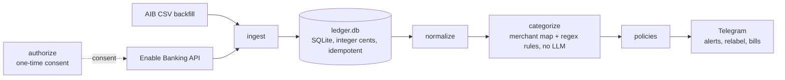

<div align="center">

<h1>SENTINEL</h1>
<p><em>Personal finance observability &amp; control over Telegram &mdash; local, deterministic, no&nbsp;LLM.</em></p>
<p>
<a href="https://github.com/nimonkaranurag/sentinel/actions/workflows/ci.yml"></a>
<a href=".python-version"></a>
<a href="https://github.com/astral-sh/ruff"></a>
<a href="https://mypy-lang.org/"></a>
<a href=".github/workflows/ci.yml"></a>
</p>
</div>

Personal, single-user finance observability and control, delivered over Telegram.
Sentinel ingests one person's own bank transactions into a local SQLite ledger,
categorizes them deterministically, and enforces spending discipline through cap
alerts, a daily safe-to-spend number, and recurring-bill tracking. It runs
locally, uses **no LLM or third-party AI**, is **read-only** (it never moves
money), and holds money as **integer cents** end to end. [`SPEC.md`](SPEC.md) is
the source of truth.

## Contents

- [Overview](#overview)
- [Features](#features)
- [Architecture](#architecture)
- [Requirements](#requirements)
- [Setup](#setup)
- [Configuration](#configuration)
- [Usage](#usage)
- [Testing and quality](#testing-and-quality)
- [Security and privacy](#security-and-privacy)
- [License and use](#license-and-use)

## Overview

Transactions arrive two ways: continuously from the [Enable Banking](https://enablebanking.com)
API (PSD2 Account Information Services, read-only), and as a one-time 12-month
backfill from AIB CSV exports. Each new charge is normalized, categorized against
a learned merchant map and regex rules, and checked against spending policies.
Breaches, relabel prompts, and the daily number are pushed to a private Telegram
chat. Everything downstream of ingest is deterministic arithmetic and templates.

Categorization is a two-tier partition: fine **sub-labels** (Dining, Coffee/Snacks,
Subscriptions, …) roll up into six **buckets** — `Income`, `Transfers`, `Fixed`,
`Groceries`, `FoodDelivery`, `Other` — used for all money math. A never-seen
merchant stays `Uncategorized` (counted in the discretionary pool) until it is
labeled through the relabel loop or `rules.local.yaml`.

## Features

1. **Policy alerts** (`policies.py`, `alerts.py`) — each new charge is checked
   against `policies.yaml`; a match over its monthly cap emits escalating,
   template-generated copy:

   > 🔴 Deliveroo €24.90 — 9th this month. €231.00 of your €150.00 food-delivery
   > cap. €2,772.00/yr at this pace.

   A durable watermark in the `state` table means a crash between ingest and send
   replays the batch on the next poll rather than silently dropping it.

2. **Two-tap relabel** (`commands.py`) — every alert carries `[✓ fine]`
   `[Reclassify…]` inline buttons. Reclassifying writes a `category_override`,
   teaches the merchant map, recomputes, and edits the message in place. Backed by
   an append-only `events` table and `processed_callbacks`: at-least-once delivery
   with idempotent effects, so a retried tap never changes anything twice.

3. **Bills checklist** (`bills.py`) — a registry of expected recurring charges.
   Alerts fire on **late** (past the due date plus grace, catching a bounced
   direct debit) and **drift** (amount outside tolerance, catching a quiet price
   change). Lateness is measured against a real due date that rolls across month
   boundaries, so end-of-month bills are detectable.

4. **Safe-to-spend** (`controller.py`) — one daily number, anchored to your
   **pay cycle** rather than the calendar month:
   `(discretionary pool − cycle-to-date discretionary spend) ÷ days to next payday`.
   The pool resets on payday (`payday.day_of_month`, default 23); when the bank
   pays early or late, `/paidtoday` logs the real day and the cycle rolls — no
   holiday calendar. Small refunds net against spend; a large unlabeled inflow
   (an unmapped transfer) is held out of the pool until labeled, so it cannot
   inflate the figure.

5. **Reports and pushes** (`notify.py`, `reports.py`) — the 08:00 safe-to-spend
   push, a Monday plan, and a deterministic Sunday digest (this week versus prior,
   top spends, surplus line, bills checklist), plus a monthly `EXPENSE_REPORT.md`
   with charts and a gap-reconciliation residual gate.

## Architecture



The money core (`db.py`) parses to integer cents, refuses floats, assigns
deterministic ids for cross-source dedupe, and enforces integer amounts at the
STRICT-table boundary. The Telegram surface is split by responsibility so the
pure-rendering layer can be tested in isolation:

| Module | Responsibility |
| --- | --- |
| `telegram.py` | Bot API transport — the single HTTP seam, with token redaction |
| `render.py` | Read-only text and keyboard rendering (reads the ledger; no writes, network, or state mutation) |
| `alerts.py` | Policy-alert engine with the durable watermark |
| `commands.py` | Owner-only command and callback router |
| `notify.py` | Cron orchestration and CLI entry point |

## Requirements

- **Python 3.12** (pinned in [`.python-version`](.python-version))
- **[uv](https://docs.astral.sh/uv/)** for dependency management and running
- **openssl** on `PATH` — signs the RS256 JWT, so no crypto package is needed
- An **Enable Banking application** (app id and RS256 private key) for API access
- A **Telegram bot** (via [@BotFather](https://t.me/BotFather)) and your chat id

Runtime dependencies are `requests`, `matplotlib`, `python-dotenv`, and `PyYAML`;
development adds `pytest`, `pytest-cov`, `ruff`, and `mypy`. All are installed by
`uv sync --dev`.

## Setup

```sh
uv sync --dev                 # install dependencies into .venv
cp .pii-patterns.example .pii-patterns && chmod 600 .pii-patterns   # fill in your identifiers
cp .env.example .env && chmod 600 .env                              # then fill in secrets (below)
make hooks                    # symlink the pre-commit hook; also chmod 600 .pii-patterns
make init                     # create data/reports/backups/logs dirs, init the schema
```

1. **Secrets** live in `.env` (git-ignored): `ENABLE_BANKING_APP_ID`,
   `ENABLE_BANKING_PRIVATE_KEY_PATH` (a path only — the key never enters the repo
   or database), `TELEGRAM_BOT_TOKEN`, and `TELEGRAM_CHAT_ID`.
2. **Bank consent (one-time):** `uv run python -m sentinel.authorize` completes
   the Enable Banking SCA handshake and writes the account uids to `state`. Re-run
   it for the ≤180-day re-authorization.
3. **Owner-specific config** goes in git-ignored local files: `rules.local.yaml`
   (employer, landlord, and family patterns → categories) and `bills.local.yaml`
   (your recurring bills). These merge ahead of the committed seed files.
4. **Backfill (optional):** drop AIB CSV exports into `data/backfill/` and run
   `make backfill`; imports are clipped to the API's coverage window so the
   overlap cannot be double-counted.

The optional hard-rails funding runbook is in [`docs/RAILS.md`](docs/RAILS.md).

## Configuration

Nothing tunable is hardcoded; every knob lives in configuration.

| File | In git | Purpose |
| --- | --- | --- |
| `config.yaml` | yes | Tunables: discretionary pool, thresholds, policy caps, ingest and retry knobs |
| `sentinel/policies.yaml` | yes | Seed spending policies (schema-checked at load) |
| `sentinel/bills.yaml` | yes | Seed recurring bills |
| `sentinel/rules.yaml` | yes | Seed categorization rules |
| `.env` | no | Secrets: Enable Banking app id and key path, Telegram token and chat id |
| `rules.local.yaml`, `bills.local.yaml` | no | Owner-specific patterns and bills, merged ahead of the seeds |
| `.pii-patterns` | no | Pre-commit PII blocklist (the list of identifiers is itself sensitive) |
| `merchant_map.json` | no | Learned merchant → category map, grown by the relabel loop |

## Usage

### Make targets

| Target | Action |
| --- | --- |
| `make init` | Create the data directories and initialize the ledger schema |
| `make hooks` | Install the pre-commit secret and PII hook |
| `make backfill` | Import AIB CSV exports from `data/backfill/*.csv` |
| `make categorize` | Run the categorizer cascade over pending merchants |
| `make relink` | Rebuild merchant links after a normalizer or rule change (atomic) |
| `make report` | Write the monthly `EXPENSE_REPORT.md` and charts |
| `make poll` | Ingest → categorize → policy + bill alerts (the cron path; consumes one API unit) |
| `make notify` | Daily safe-to-spend push only (command answering is the `--listen` process) |
| `make plan` | Monday weekly-plan push (idempotent per ISO week) |
| `make digest` | Sunday weekly digest |
| `make backup` | Safe SQLite `.backup` (never a filesystem copy of a live WAL database) |
| `make test` | Run the test suite |

There is deliberately no alert-less `ingest` target: `poll` is the one ingest
path, so a charge cannot book without being checked.

### Telegram commands

Delivery goes to `TELEGRAM_CHAT_ID`; **authority** is the sender's id checked
against `TELEGRAM_OWNER_ID` (which defaults to the chat id). So the bot can be
pointed at a group without letting other members drive the ledger — set
`TELEGRAM_OWNER_ID` to your own user id when the chat is a group.

| Command | Effect |
| --- | --- |
| `/today` | What's safe to spend today, with pool status and days to payday |
| `/status` | This **pay cycle**'s spend by bucket, plus safe-to-spend |
| `/cat <name>` | A category and this month's transactions (with refs) |
| `/sync` | Attended bank pull (exempt from the daily unattended allowance) |
| `/recat <ref> <category>` | Recategorize a transaction and teach its merchant |
| `/date <ref>` | Mark one transaction as `Dates`, leaving the merchant untouched |
| `/paidtoday [date]` | Log the day your salary landed (early on a weekend/bank holiday, or late) so the pay cycle rolls to it (aliases: `/paid-today`, `/paid_today`) |

The inline `[✓ fine]` `[Reclassify…]` keyboard accompanies every alert. Answering
commands and taps in real time needs the **listener** running (see Scheduling):

```sh
uv run python -m sentinel.notify --listen   # the single always-on getUpdates reader
```

On startup the listener publishes the `/` command menu (`setMyCommands`), so the
commands above are discoverable with descriptions in any Telegram client. This is
best-effort — a transient failure is logged and never stops the bot answering.

### Scheduling

Two pieces, deliberately split so nothing collides on Telegram's single-reader
`getUpdates`:

1. **Scheduled jobs** (push-only, never call `getUpdates`) — four unattended polls
   per day (07:45, 12:45, 17:45, 21:45), the 08:00 daily push, the Monday 08:05
   plan, the Sunday 18:00 digest, and a 02:30 nightly backup. Each push is
   idempotent per period, so a re-run cannot double-send.
2. **Listener** (`--listen`) — the one `getUpdates` reader; it answers `/commands`
   and inline taps in real time. Without it, a tap sits in Telegram's queue until
   the next attended pass, so it is **required, not optional**.

The production deploy is an always-on Linux host running the systemd units in
[`deploy/systemd/`](deploy/systemd/) — the listener is `sentinel-listen.service`
and the scheduled jobs are the `sentinel-*.timer` units — with push-to-`main`
auto-deploy via [`.github/workflows/deploy.yml`](.github/workflows/deploy.yml).
For a laptop, [`deploy/crontab.txt`](deploy/crontab.txt) is a self-contained
alternative: the timed jobs plus a `@reboot` flock'd `--listen`.

## Testing and quality

```sh
uv run ruff check .
uv run mypy sentinel
uv run pytest -q --cov=sentinel --cov-report=term-missing --cov-fail-under=80
```

CI ([`.github/workflows/ci.yml`](.github/workflows/ci.yml)) runs the same lint,
type, and test steps — coverage gated at 80% — plus a `gitleaks` secret scan over
full history. Third-party actions are pinned to commit SHAs. Every correctness
claim in `SPEC.md` (dedupe, the residual gate, cross-month bill lateness, the
alert watermark, sender-id authorization) is pinned by a test.

## Security and privacy

- **No payment initiation, ever.** Sentinel consumes read-only Account
  Information Services and cannot move money. It never stores bank credentials;
  access is a short-lived, locally signed JWT.
- **Money integrity.** Integer cents throughout, with STRICT tables refusing
  non-integers. Ingest rejects sign-ambiguous and non-EUR entries into a
  `quarantine` table (retained with the raw row and reason, surfaced as a count in
  `/status`) rather than dropping them silently; the CSV backfill clips to the API
  window to avoid double-counting.
- **Secrets and PII stay out of git.** `.env`, `ledger.db`, `merchant_map.json`,
  `rules.local.yaml`, `bills.local.yaml`, and `.pii-patterns` are git-ignored. The
  portable pre-commit hook (gitleaks, generic secret shapes, and a grep against
  the git-ignored `.pii-patterns`) blocks secrets and PII before they enter
  history. The bot token is redacted from every error path.

See [`docs/PRIVACY.md`](docs/PRIVACY.md) for the full data-handling policy.

## License and use

Licensed under the **PolyForm Noncommercial License 1.0.0** — see
[`LICENSE`](LICENSE). A personal, non-commercial project, provided as-is without
warranty and not offered as a service to third parties. See
[`docs/TERMS.md`](docs/TERMS.md) and [`docs/PRIVACY.md`](docs/PRIVACY.md); the key
design decisions are recorded as ADRs in [`docs/adr/`](docs/adr/).
