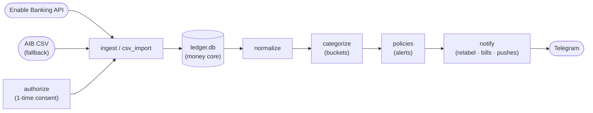

# SPEC.md — Sentinel

Single source of truth. Sentinel is a **personal, single-user** tool that turns
one person's own bank feed into **real-time-ish spending discipline over
Telegram**. It runs locally, uses no LLM/AI, and initiates no payments.

---

## 1. Problem

The owner has steady income plus a recurring family transfer, yet still reaches
€0 by payday: spending regulates to the perceived account balance because there
is no sensor and no in-the-moment feedback. Sentinel is that sensor — it watches
charges as they book, and pushes context + a correction path to Telegram.
(Concrete figures live only in the owner's git-ignored `rules.local.yaml` /
`config.yaml`, never here.)

**Goals:** (1) alert the moment a spending policy is breached; (2) make
correcting a mislabel a two-tap action; (3) never miss a bill; (4) surface one
honest daily "safe to spend" number.

**Non-goals:** payment initiation (never — no PISP licence), scraping AIB
internet banking (T&C breach), any LLM/AI dependency, a web UI, multi-user.

---

## 2. Architecture

**Money core:** SQLite STRICT tables, integer cents everywhere (`to_cents`
refuses floats), stable bank ids with a
`sha256(booking_date|amount|merchant|account)` fallback, `INSERT OR IGNORE`
idempotent ingest, WAL. `db.backup` uses the SQLite backup API — never `cp` a
live WAL DB. Ingest re-pulls a few days behind its cursor so backdated bookings
aren't lost; the CSV backfill clips to the API's coverage start so the overlap
window is never double-counted; non-EUR rows are quarantined rather than summed
at face value.

**Stack:** Python 3.12+, stdlib `sqlite3` (raw SQL, no ORM), `requests`,
`matplotlib` (charts), `python-dotenv`, `PyYAML`. Telegram via raw HTTPS. No
`openai`/`anthropic`, no `pandas`.

---

## 3. Categorization — two tiers

Cascade (stop at first hit, no LLM): **normalize** (strip processor prefixes,
the Enable Banking `{…}` enrichment blob, trailing store numbers/dates; keep a
single brand + city distinct) → **owner merchant map** (`merchant_map.json`,
owner-written) → **regex rules** (`rules.yaml` + git-ignored `rules.local.yaml`
merged ahead). A never-seen merchant stays `Uncategorized`.

Fine **sub-labels** (Dining, Coffee/Snacks, Subscriptions, …) roll up via
`categorize.bucket()` into 6 **buckets** used for all money math:
`Income · Transfers · Fixed · Groceries · FoodDelivery · Other`. `Uncategorized`
→ `Other` = the discretionary pool. No coverage gate.

`categorize --relink` clears and re-links merchants after a normalizer change.

---

## 4. The five features

1. **Policy alerts** (`policies.py` + `alerts.py`, `policies.yaml`). Per poll,
   each newly booked spend txn is matched (bucket | sub_label | pattern, the
   pattern against the *normalized* name) against monthly caps; over-cap emits
   escalating templated copy. YAML schema-checked (a typo crashes). Refunds net
   against spend, so they never fire false alerts. A durable watermark in `state`
   records what's been evaluated, so a crash between ingest and send replays
   instead of silently dropping the batch; `/sync` alerts too, not just the cron.
2. **Two-tap relabel** (`commands.py`). Every alert carries `[✓ fine]
   [Reclassify…]`. Reclassify → closed sub-label grid → writes `category_override`
   + teaches the merchant map → recomputes → edits the message in place. Backed
   by append-only `events` + `processed_callbacks` tables: at-least-once delivery
   with idempotent effects (a retried tap changes nothing twice).
3. **Bills** (`bills.py`, git-ignored `bills.local.yaml`). Registry of expected
   recurring charges. Each poll (and `/sync`) fires **late** (past the due date +
   grace, measured against a real date that rolls across month boundaries so
   end-of-month bills are detectable = bounced debit) and **drift** (outside
   tolerance = price hike), each guarded by a per-cycle `state` key so one late
   bill sends one message per cycle, not one per poll; also rendered in the weekly
   report.
4. **Safe-to-spend** (`controller.py`). Anchored to the owner's **pay cycle**,
   not the calendar month: the pool resets on payday and the number is what's
   left spread over the days to the *next* payday. `safe_today = max(0,
   (pool_monthly_cents − cycle-to-date discretionary) ÷ days_to_next_payday)`.
   Payday is a nominal day-of-month (`payday.day_of_month`, default 23); Sentinel
   keeps **no holiday calendar**, so when the bank pays early (a weekend/bank
   holiday) or late the owner logs the real day with `/paidtoday`, which writes
   a per-cycle override that rolls the cycle. The pool is a config number;
   underspend rolls forward, overspend drags it down. Small refunds net against
   spend; a large unlabeled inflow (an unmapped transfer) is held out of the pool
   until labeled, so it can't inflate the number.
5. **Pushes + monthly report.** Daily 08:00 safe-to-spend (traffic light,
   idempotent), Monday plan (`--plan`), deterministic weekly digest (`--digest`,
   week vs prior + surplus line + bills checklist), and monthly `EXPENSE_REPORT.md`
   (`reports.py`: Paretos, size bands, reconciliation, and month-over-month
   bucket deltas + `subscriptions.md` + charts).

Commands (owner chat only): `/today /status /cat /sync /recat /date /paidtoday`
(published as the Telegram `/` menu via `setMyCommands` when the listener starts;
`/paid-today` and `/paid_today` are accepted aliases).

---

## 5. Data model

`transactions` · `merchants` · `state` (cursors, consent expiry, per-day API
counter, the alert watermark, per-cycle bill-alert keys, per-cycle logged-payday
overrides, idempotency keys — key formats in `state_keys.py`) · `events` + `processed_callbacks` (relabel loop) ·
`quarantine` (rows that cannot be booked — non-EUR, sign-ambiguous, malformed —
kept with the raw row + reason, deduped by fingerprint, surfaced in `/status`;
migration 006). No `budgets`, `llm_calls`, envelope, or graduation tables (v1
`schema.sql` creates `budgets`; migration 005 drops it and removes the dead
`'llm'` provenance value).

---

## 6. Ops & cadence

Cron (Europe/Dublin): 4 unattended `make poll` (the one ingest path — consent
check, then ingest+categorize+policy/bill alerts, consuming the ~4/day PSD2
allowance via a serialized `BEGIN IMMEDIATE` read-modify-write) · `make notify`
08:00 (push only) · `make plan` Monday · `make digest` Sunday · nightly
`make backup` (never VACUUM — it renumbers rowids under the alert watermark).
None of the crons call `getUpdates`: command-answering is an always-on
`--listen` reader (`sentinel-listen.service`, or the `@reboot` line in
`deploy/crontab.txt`), the single getUpdates reader Telegram allows — units in
`deploy/systemd/`. `/sync` is owner-initiated (attended): it
sends `Psu-Ip-Address` (this host's real LAN IP, or a config override — never a
loopback fiction) / `Psu-User-Agent` headers → exempt from the unattended
allowance (RTS Art. 36(5)), and it categorizes + alerts like a poll. A transient
bank 5xx or connection error gets a bounded, jittered retry; a 4xx fails fast,
and a 401/403 (expired/revoked consent) is turned into a re-auth message. Consent
≤180 days, with a T−14d expiry nag on every poll; re-auth is `authorize.py`.

---

## 7. Security & privacy

Secrets only in `.env` (git-ignored, `chmod 600`); private key referenced by
path, never stored. Owner-specific PII (employer/landlord/family/bills) lives in
git-ignored `rules.local.yaml` / `bills.local.yaml`, merged at load. The bot
token is redacted from every error path (one send seam in `telegram.py`).
Delivery and authority are separate: pushes go to `TELEGRAM_CHAT_ID`, while bot
commands and inline taps are authorized by the **sender's** id (`from.id`)
against `TELEGRAM_OWNER_ID` (which defaults to the chat id). So the bot can be
delivered into a group without handing control to its members, and the owner
still drives it.
`ledger.db`, `merchant_map.json`, reports, and `CODE-REVIEW.md` are git-ignored;
the pre-commit hook (`scripts/pre-commit`) is portable — gitleaks + a grep
against a **git-ignored** `.pii-patterns` file, so the hook's logic can be
committed while the identifiers it blocks never are (install with `make hooks`).
Third parties: Enable Banking + Telegram only — categorization, alerts, and
reports run entirely
locally. CI gates on `ruff`, `mypy`, `pytest` (+coverage), and `gitleaks`.
